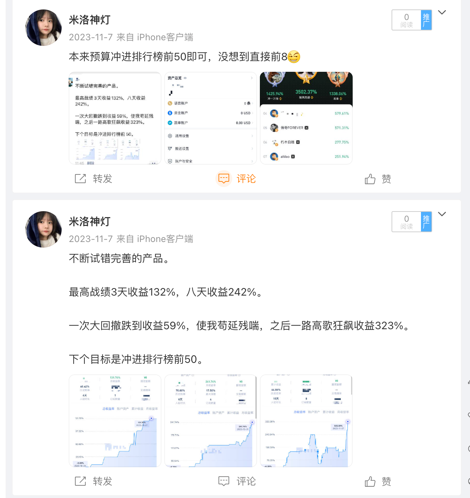
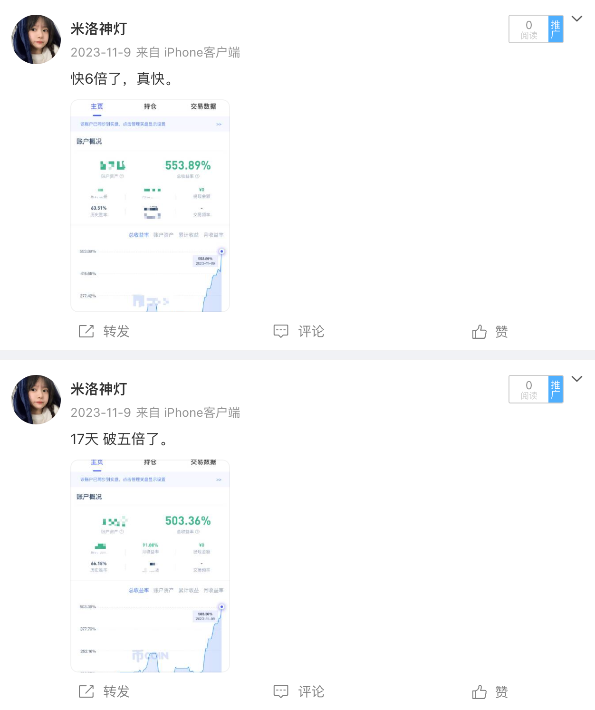
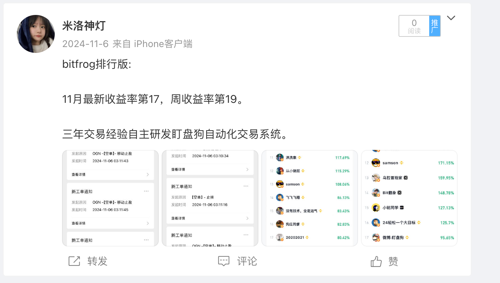
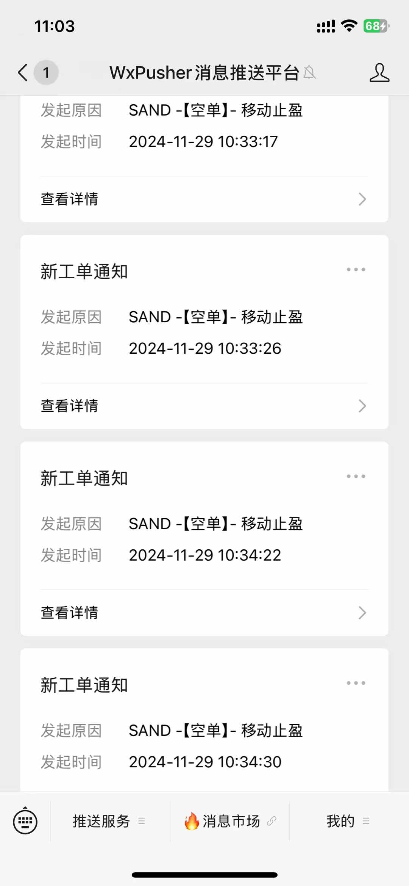
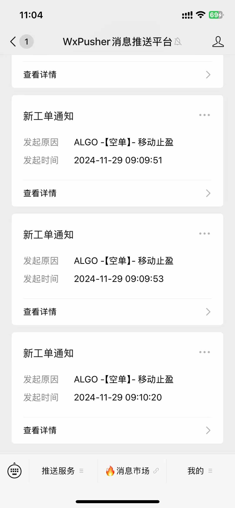
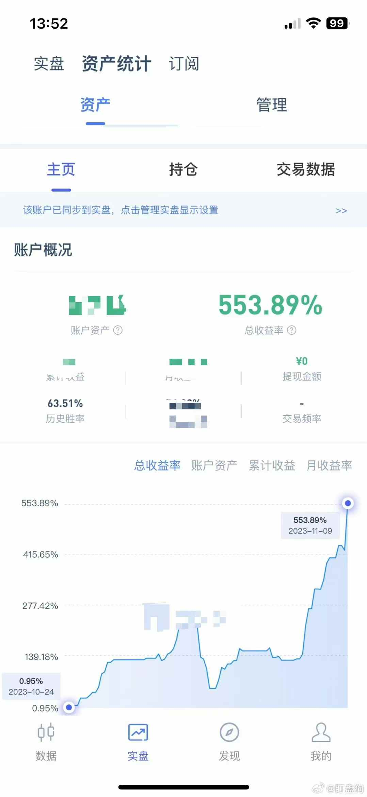
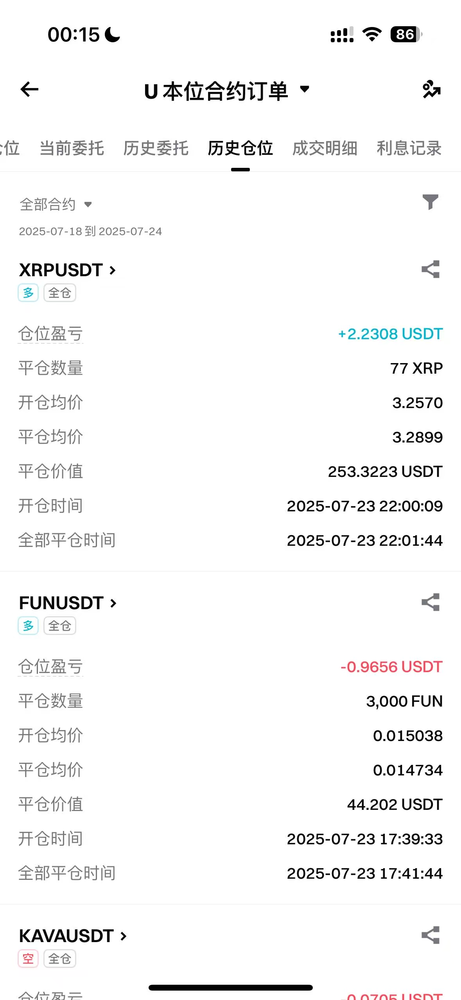
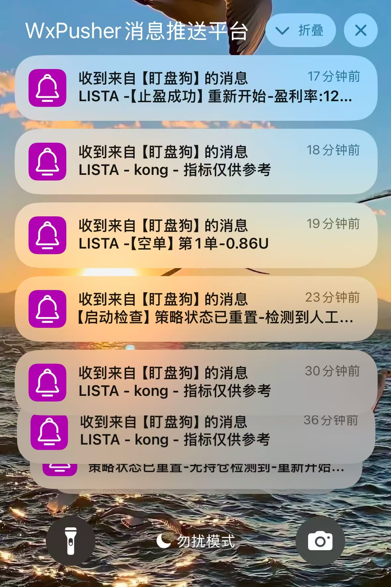
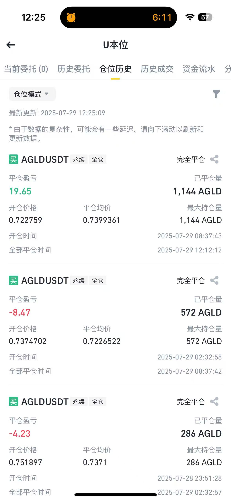
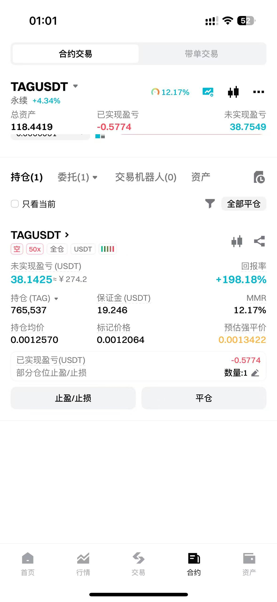

# 我的笔记

## 📚 文章目录
- [1. 策略介绍](https://github.com/Maikefee/DingPanDog/wiki/策略介绍)
- [2. 实盘记录](https://github.com/Maikefee/DingPanDog/wiki/实盘记录)
- [3. 笔记](https://github.com/Maikefee/DingPanDog/wiki/笔记)

---

### tg群：https://t.me/shipanjiankong

### 联系v：rggboom，加我可以拉群
-----------

### 🧠 币圈/虚拟货币/量化策略名称：盯盘狗

#### 1️⃣ 策略说明：

##### 🔍 原理：

- 通过监控 50 多个币种，当有条件的开仓信号出现时自动开仓；
- 若止损，则下一次双倍开仓，循环执行直到止盈；
- **最大战绩：**
	- 三天收益 **133%**
	- 八天收益 **242%**
	- 十七天收益 **553%** 🚀

##### ✅ 优点：

- 自动开仓 + 自动止盈止损
- 胜率高达 **80%**

#### 📹 实盘视频：

[点击观看策略演示视频](./img/1.MP4)

--------

# 7月左右的实盘记录

