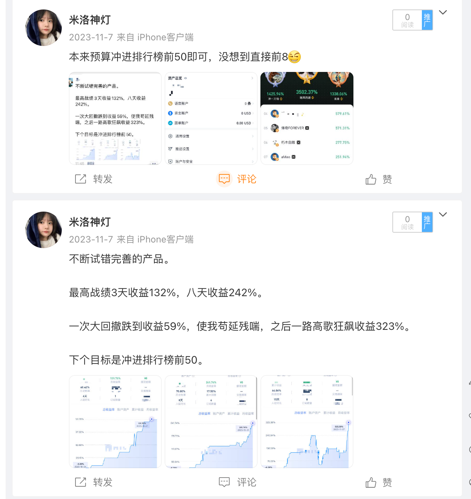
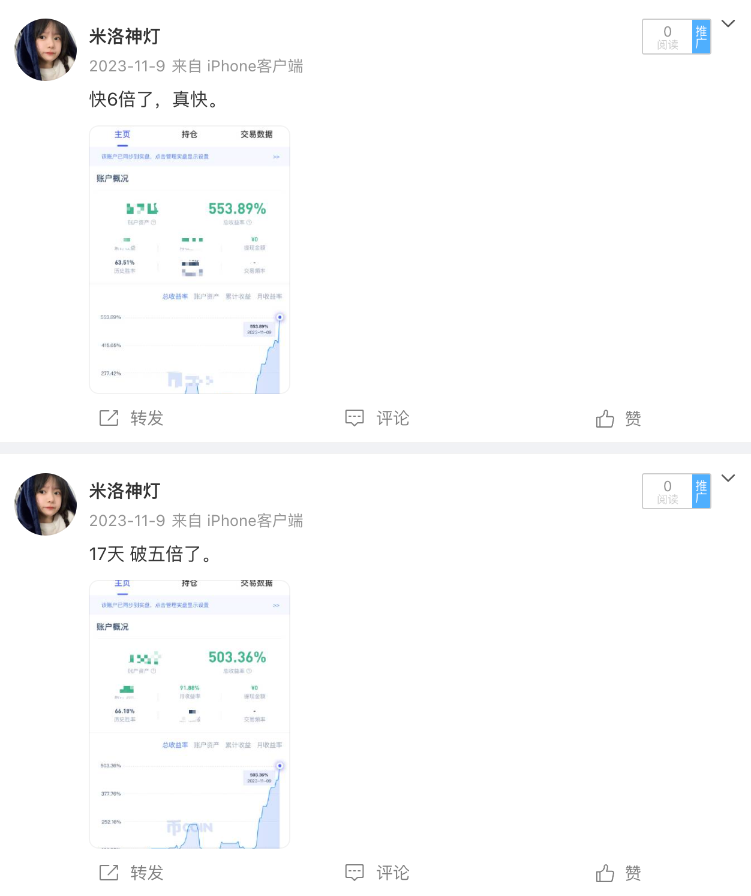
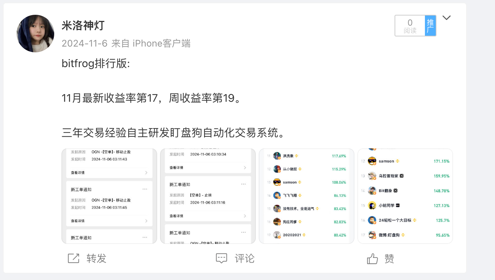
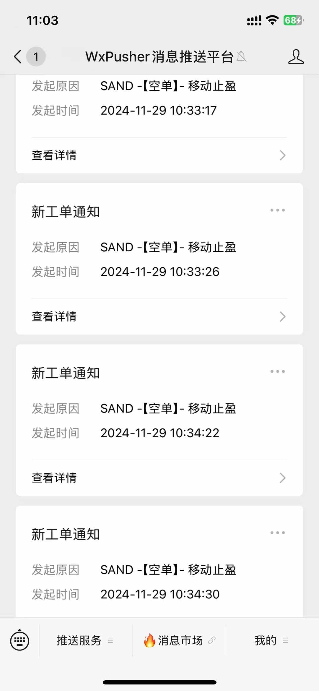
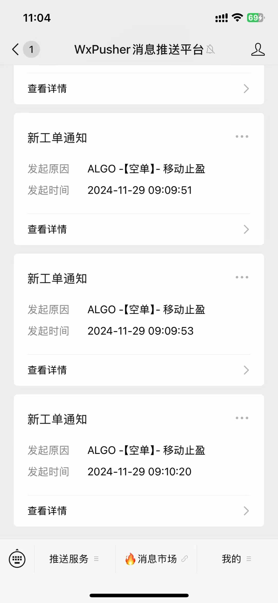
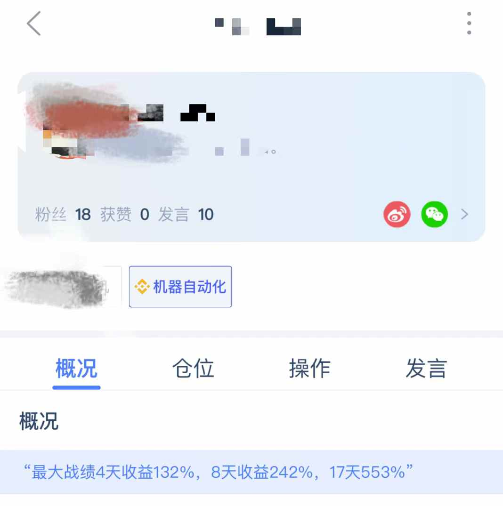
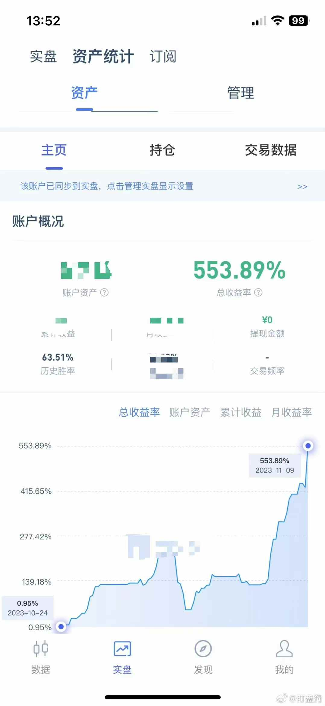
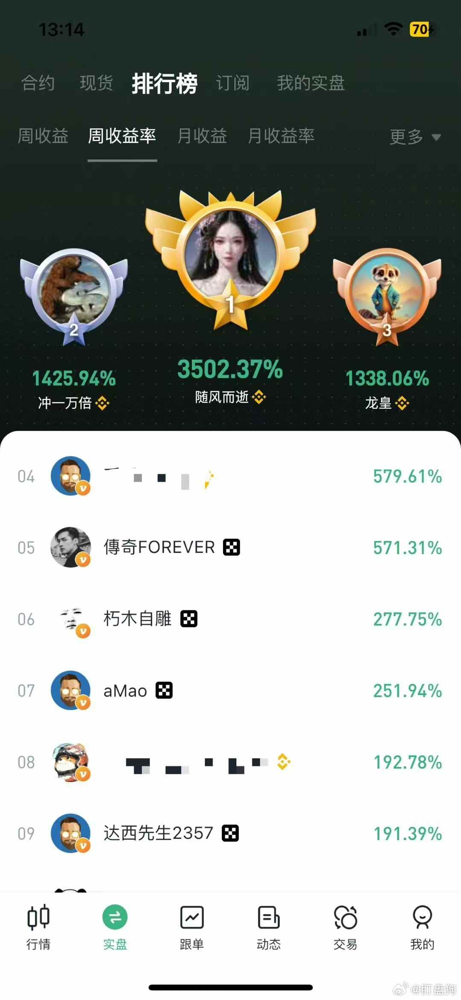

### tg群：https://t.me/shipanjiankong
### 联系v：rggboom，加我可以拉群
-----------

### 🧠 币圈/虚拟货币/量化策略名称：盯盘狗

#### 1️⃣ 策略说明：

##### 🔍 原理：

- 通过监控 50 多个币种，当有条件的开仓信号出现时自动开仓；
- 若止损，则下一次双倍开仓，循环执行直到止盈；
- **最大战绩：**
	- 三天收益 **133%**
	- 八天收益 **242%**
	- 十七天收益 **553%** 🚀

##### ✅ 优点：

- 自动开仓 + 自动止盈止损
- 胜率高达 **80%**

#### 📹 实盘视频：

[点击观看策略演示视频](./1.MP4)

